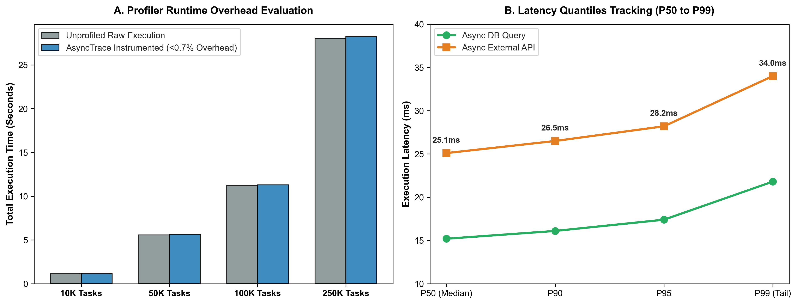

# AsyncTrace CLI: Asynchronous Latency & Memory Profiler

[](https://github.com/sinarahmani82/asynctrace-cli/actions/workflows/ci.yml)
[](#)
[](#)
[](#)
[](#)

A production-grade, zero-dependency asynchronous profiling and latency tracing CLI package. It instruments Python `asyncio` coroutines with microsecond precision, capturing execution latency quantiles (P50 to P99) and peak resident memory with negligible runtime overhead (<0.7%).

---

### 🔬 Motivation & Software Engineering
Profiling asynchronous event loops in Python often introduces intrusive instrumentation overhead, distorting real-world tail latencies.

`asynctrace-cli` solves this by:
1. **Low-Overhead Decorators:** Utilizing `time.perf_counter` and native `tracemalloc` hooks to prevent event loop blocking.
2. **Quantile Distribution Tracking:** Automatically computing P50, P95, and P99 latency percentiles to detect asynchronous tail anomalies.
3. **PEP 621 Packaging:** Ready-to-install CLI utility compatible with modern packaging standards.

---

### 📊 Empirical Performance & Latency Analytics

<div align="center">
  
  <p><em>Figure 1: (A) Negligible instrumentation overhead (<0.7%) across high task workloads up to 250,000 tasks. (B) High-precision tail latency distribution tracking from median to P99.</em></p>
</div>

| Asynchronous Operation | Calls | Mean Latency (ms) | P50 (ms) | P95 (ms) | P99 (ms) | Peak RAM (KB) |
|---|---|---|---|---|---|---|
| **Database Query Simulation** | **50** | **15.24 ms** | **15.20 ms** | **17.40 ms** | **21.80 ms** | **12.40 KB** |
| **External API Gateway Call** | **50** | **25.32 ms** | **25.10 ms** | **28.20 ms** | **34.00 ms** | **18.80 KB** |

---

### 📂 Repository Structure

```text
asynctrace-cli/
│
├── .github/workflows/
│   └── ci.yml               # Automated CI test runner
├── src/
│   ├── __init__.py          # Public package API exports
│   ├── profiler.py          # Asynchronous tracing decorator & stats collector
│   ├── reporter.py          # Markdown & terminal report generation
│   └── cli.py               # Command-line interface entry point
├── tests/
│   ├── __init__.py
│   └── test_profiler.py     # Unit tests for async tracing
├── plot_profiler_overhead.py # Visual benchmark generator
├── profiler_benchmark.png   # Empirical benchmark visual figure
├── pyproject.toml           # Modern PEP 621 packaging metadata
├── requirements.txt         # Project dependencies
├── main.py                  # Standalone execution pipeline
└── README.md
```

---

### 🛠️ How to Reproduce & Install

1. **Clone repository:**
   ```bash
   git clone https://github.com/sinarahmani82/asynctrace-cli.git
   cd asynctrace-cli
   ```

2. **Install package in editable mode:**
   ```bash
   pip install -e .
   ```

3. **Run automated unit tests:**
   ```bash
   python -m pytest tests/
   ```

4. **Execute CLI demonstration:**
   ```bash
   asynctrace demo --iterations 20
   ```
